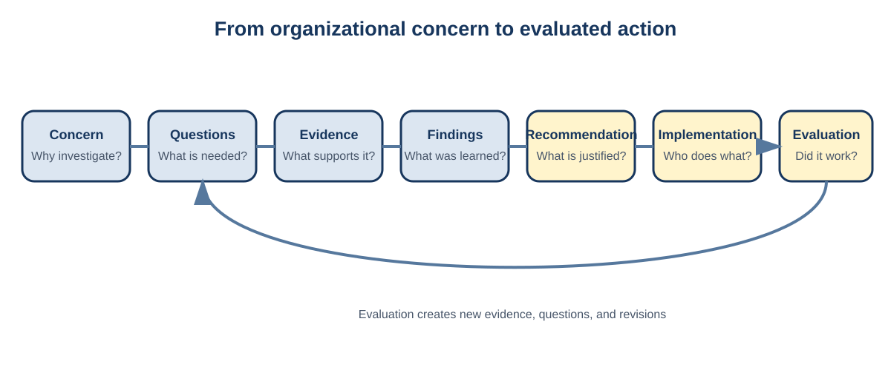

# Applied Data Science Projects

## Learning outcomes

After completing this chapter, you should be able to:

- explain how an applied project differs from a conventional analysis exercise;
- describe the connected stages of a client-focused data science project;
- distinguish an organizational concern from an analytical question;
- define useful project deliverables and success criteria; and
- explain why responsible project work is iterative.

## Key terms

::: {.definition}
**Applied data science project:** A bounded investigation that uses data, analytical methods, contextual knowledge, and communication to improve understanding or support a real decision.

**Client:** The person or organization that commissions, sponsors, receives, or uses the project's work. The client may be external to the analytical team or part of the same organization.

**Stakeholder:** Anyone who affects, is affected by, or has a legitimate interest in the project, its data, its methods, or its consequences.

**Deliverable:** A defined product, such as a report, model, dashboard, data dictionary, presentation, or recommendation package, that must satisfy stated content and quality expectations.

**Scope:** The agreed boundary of the project, including what questions, populations, data, methods, time periods, and outputs are included or excluded.

**Analytical question:** A question that identifies what will be described, compared, explained, predicted, or projected using data.

**Success criterion:** An observable condition used to judge whether a project, analysis, or deliverable has achieved its intended purpose.

**Iteration:** A deliberate return to an earlier stage of work so that a question, method, assumption, or deliverable can be revised using new evidence.
:::

## What makes an applied project different?

A conventional exercise usually begins with a prepared dataset, a specified method, and a question that is known to be answerable. An applied project begins with uncertainty. The client may describe a concern rather than a measurable problem. The data may have been collected for operations rather than analysis. Important definitions may exist only in the knowledge of staff members. The requested outcome may be broader than the available evidence can support.

These conditions change the analyst's responsibility. The task is not simply to select an algorithm. The analyst must determine what the organization needs to understand, assess whether the available data can answer that need, choose methods that fit the evidence, and communicate the result without overstating certainty.

Applied projects also combine forms of work that are often taught separately. Data management affects modelling. Domain knowledge affects variable interpretation. Project planning affects whether sufficient time remains for validation. Visualization affects whether a correct result can be understood. Recommendations affect which assumptions matter most. A weakness in any one area can reduce the usefulness of the entire project.

::: {.note}
**Project principle:** Technical sophistication does not compensate for an unclear question, unreliable data, unsupported interpretation, or unusable recommendation.
:::

## Projects as decision systems

A useful way to understand a project is as a chain of connected decisions:

1. **Problem decision:** What issue deserves investigation?
2. **Evidence decision:** Which data and secondary sources are relevant?
3. **Measurement decision:** How will concepts such as demand, value, risk, retention, or success be represented?
4. **Method decision:** Which analytical approach fits the question and evidence?
5. **Interpretation decision:** What conclusions are supported, and what remains uncertain?
6. **Action decision:** What should the client consider doing?

An error early in this chain can travel through the entire project. For example, if customer activity is measured using transactions rather than unique customers, later claims about customer growth may be misleading. If a projection uses a population denominator that does not match the client's service area, the final capacity recommendation may be inaccurate even when the arithmetic is correct.

## The applied project cycle

A practical project cycle contains six connected activities:

1. **Frame:** Understand the organization, decision, audience, constraints, and intended use.
2. **Plan:** Define deliverables, responsibilities, milestones, dependencies, risks, and review points.
3. **Understand:** Document the data, assess quality, investigate context, and conduct exploratory analysis.
4. **Analyze:** Select, evaluate, and compare methods that answer the analytical questions.
5. **Interpret:** Connect results to context, assumptions, limitations, and practical consequences.
6. **Communicate:** Build a coherent report, presentation, implementation plan, and final handoff.

The stages are connected rather than strictly sequential. Exploratory analysis may reveal that the original question cannot be answered. A model may expose a data-quality problem. Secondary research may show that an important category definition has changed. Feedback may require a different comparison or projection. Returning to an earlier stage is responsible when the reason and resulting decision are documented.

{width=100%}

## Integrated project evidence

Many applied projects require several kinds of evidence. Depending on the problem, a project may include:

- a profile or segmentation of important populations, customers, services, products, or regions;
- an appropriate descriptive, statistical, or machine-learning analysis;
- a forecast or conditional projection;
- relevant secondary research;
- problems or opportunities identified primarily from the organization's data; and
- realistic recommendations that can be traced to the analysis.

These elements should form one argument. They should not appear as independent demonstrations joined only by a table of contents. Segmentation should clarify which groups matter. Modelling should answer a defined question. Forecasting should show the future consequence of a pattern or assumption. Secondary research should improve interpretation. Recommendations should respond to the problems established by the evidence.

## From concern to analytical question

Suppose a service organization says, "Demand seems to be increasing, and we do not know whether current capacity will be enough." This statement identifies a concern, but it does not yet specify what should be measured.

The concern can be separated into several analytical questions:

- How has service volume changed over time?
- How has utilization changed by location and age group?
- Is the change associated with population growth, changing utilization rates, or both?
- What demand would be expected if current group-specific utilization rates continued?
- Which groups or locations account for the greatest projected increase?
- Which operational constraints would become important under each scenario?

Each question implies different data, definitions, methods, and limitations. The first is descriptive. The third requires compatible population denominators. The fourth is a conditional projection rather than a promise about the future. The final question may require information that is not present in the service dataset at all.

::: {.example}
**Worked example: refining a broad request**

A retailer asks, "Which customers should we target?"

A useful refinement process might produce the following questions:

1. Which customer groups differ meaningfully in purchase frequency, contribution margin, product mix, or retention?
2. Are the differences stable across time periods and sales channels?
3. Which groups have sufficient size and potential value to justify a distinct strategy?
4. What action could the retailer take for each selected group?
5. Which metric would indicate that the action was working?

The refined questions prevent the team from creating attractive customer labels that have no analytical or operational purpose.
:::

## Defining success

A project needs more than a completion deadline. Success criteria should address both analytical quality and practical usefulness. Examples include:

- every reported value can be reproduced from documented data and code;
- projected demand is calculated from compatible populations and rates;
- the selected model performs better than a relevant baseline on unseen data;
- each recommendation is supported by client evidence and has a measurable evaluation plan;
- the final audience can understand the central conclusion without reading the technical appendix; and
- confidential information is handled according to all applicable requirements.

A criterion such as "produce a professional report" is too vague by itself. A stronger criterion specifies what professional quality means in the context of the project.

::: {.quality}
**Quality standard:** A project question should identify the population or unit, the outcome of interest, the comparison or time frame, and the intended use whenever these are known.
:::

## Common mistakes

- accepting the initial request without clarifying what decision it supports;
- defining success only as submitting the final files;
- selecting a preferred method before understanding the data;
- treating every requested analysis as equally useful;
- confusing a conditional projection with a guaranteed forecast; and
- delaying integration until each team member believes their individual work is finished.

## Applied exercises

1. Write a project brief for NVRW that identifies the decision, audience, population, time period, deliverables, exclusions, and success criteria.
2. Trace one possible error from data definition through analysis, recommendation, implementation, and evaluation. Explain where a review gate could prevent the error from travelling further.
3. Classify each proposed output as evidence, interpretation, action, or evaluation. Revise any output that does not contribute to the decision.

Check your work

A complete brief defines success in observable terms. "Produce a good analysis" is not sufficient. A stronger criterion would require validated data, reproducible results, documented limitations, and recommendations that can be traced to evidence.

## Questions for discussion

1. Why might a technically accurate model still fail as a professional deliverable?
2. What evidence would show that a project has become too broad?
3. When should a team revise its original analytical question?
4. Which success criteria would matter most for a public-facing dashboard? Which would matter most for an internal forecasting model?
