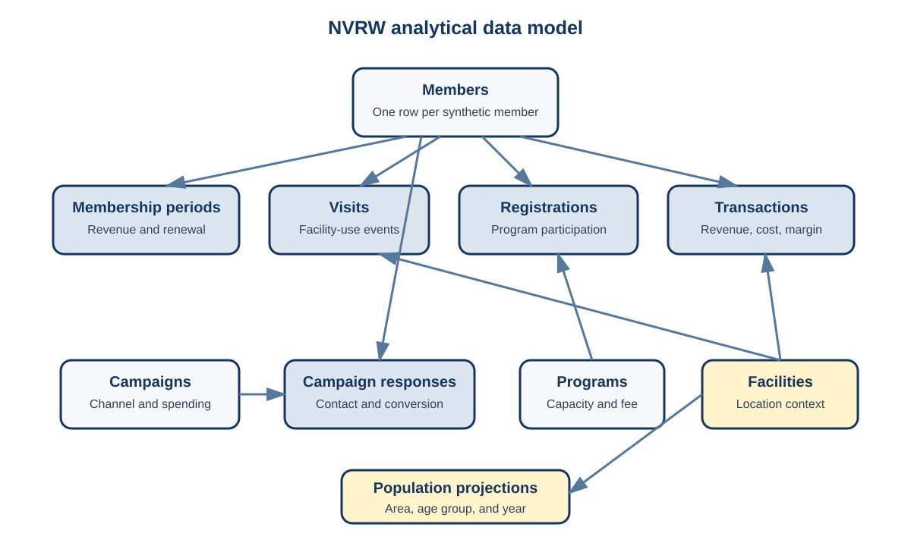
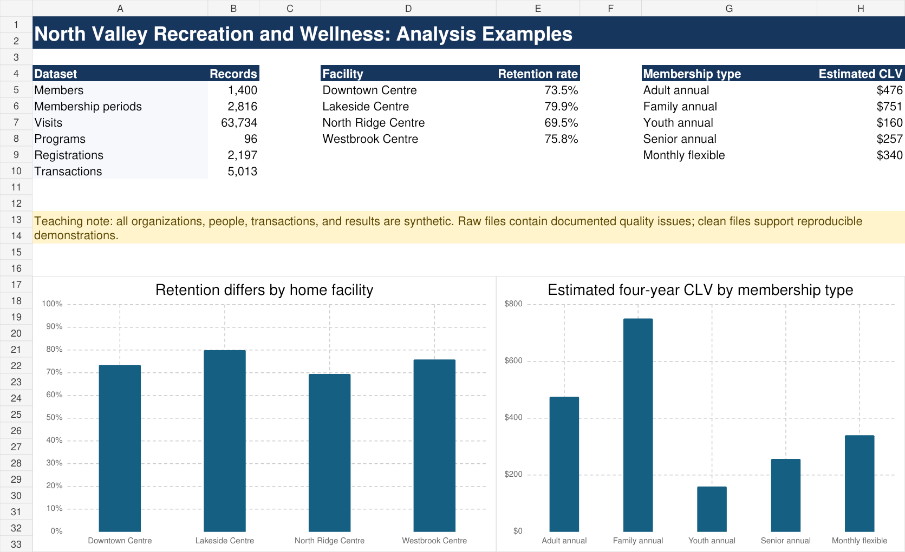

# Appendix: NVRW Complete Project Synthesis

This appendix assembles the North Valley Recreation and Wellness case into one complete applied project. Earlier chapters use individual pieces of the case to teach particular methods. Here, those pieces are connected into a single argument from organizational concern to implementation and evaluation.

The synthesis is an excellent model of project structure, not a claim that every project must use the same methods. All data and results are synthetic. The analysis is designed to show how questions, evidence, methods, limitations, and recommendations should fit together.

## Executive summary

North Valley Recreation and Wellness operates four recreation centres and wants to improve retention, allocate program capacity more effectively, and prepare for future demand. The analysis combines synthetic membership, visit, program, transaction, campaign, and population data.

Three conclusions are especially important:

1. **Retention differs meaningfully across facilities.** First-period retention is 75.8 percent overall, ranging from 69.5 percent at North Ridge to 79.9 percent at Lakeside. The difference is descriptive and should prompt investigation rather than an assumption that facility location causes renewal.
2. **Early engagement provides useful predictive information.** Visit activity and program participation during the first membership period can help identify members who may benefit from timely support. A prediction model should be used to prioritize a limited outreach list, not to label members permanently or deny service.
3. **Demand and value are uneven.** Average program fill is approximately 83 percent, while some offerings are nearly full and others remain below 60 percent. Constant-rate population projections imply approximately 9 percent growth in visits at three facilities and 12.5 percent at Westbrook from 2025 to 2030. Estimated four-year CLV also varies by membership type because margin and retention differ.

NVRW should pilot an early-engagement program, review program capacity using repeated demand evidence, and incorporate population-based projections into facility planning. Each action should be evaluated prospectively. None of the observational results establishes the effect of an untested intervention.

## Project brief

**Organizational concern:** Demand, retention, and program participation appear uneven across locations, but leadership does not know which patterns are reliable or actionable.

**Primary decision:** How should NVRW prioritize limited service, retention, marketing, and capacity-planning resources?

**Population:** Members, facility visits, program registrations, and transactions observed from 2022 through 2025, together with synthetic service-area population projections through 2030.

**Primary analytical questions:**

1. How do visit volume, service mix, program demand, and retention vary across facilities and time?
2. Which information available early in a membership is associated with first-period renewal?
3. What future visit volume would occur if current utilization rates continued as service-area populations changed?
4. How do retention, contribution margin, acquisition cost, and discounting affect estimated CLV by membership type?

**Scope exclusions:** The project does not estimate the causal effect of a retention intervention, infer motivations not recorded in the data, optimize staffing schedules, or determine whether facility differences are caused by location management.

**Success criteria:** The project succeeds if it produces validated data, reproducible analysis, a transparent explanation of uncertainty, recommendations connected to evidence, and implementation measures that can determine whether the recommendations work.

## Team charter and work plan

A suitable project charter would identify a project coordinator, data lead, analytical lead, secondary-research lead, and communication lead. These are areas of responsibility, not isolated silos. Every major result should receive a technical review and a communication review by someone other than its original author.

The team would agree to:

- keep raw data unchanged and perform cleaning through reproducible scripts;
- record variable definitions and analytical decisions in shared files;
- use one approved project repository;
- identify the owner and reviewer of every deliverable;
- document unresolved questions and decisions after each meeting;
- escalate confidentiality, access, or scope concerns rather than resolving them informally; and
- integrate sections throughout the project instead of combining independent reports at the end.

A twelve-week plan could allocate two weeks to framing, access, and documentation; three weeks to EDA and secondary evidence; three weeks to modelling and projections; two weeks to recommendations and validation; and two weeks to integration, revision, presentation practice, and handoff. Review time is included within every phase.

## Data package and relationships

The project uses ten core tables. Members connect to membership periods, visits, registrations, transactions, and campaign responses. Programs connect to registrations, while campaigns connect to responses. Facilities provide location context for operational tables. Population projections connect through facility service area, age group, and year.

{width=100%}

The complete package is available in [`data/nvrw/`](data/nvrw/README.md). It includes raw files, clean files, derived tables, a data dictionary, an Excel workbook, R scripts, and a Power BI guide.

The principal units of analysis are deliberately different:

- one row per member in `members.csv`;
- one row per member-period in `membership_periods.csv`;
- one row per facility entry in `visits.csv`;
- one row per program offering in `programs.csv`;
- one row per registration in `registrations.csv`; and
- one row per service-area, age-group, and year in `population_projections.csv`.

These tables cannot be joined casually. Joining every visit to every membership period for a member would duplicate visits when the member has several periods. The analyst must match each visit to the appropriate period or aggregate visits to the required unit before joining.

## Data dictionary and quality assessment

The dictionary records the dataset, variable, type, definition, allowed values or unit, and known quality issue. It also distinguishes identifiers from measurements and explicitly defines `Censored` as a renewal outcome that cannot yet be observed.

The raw visit data contain 64,131 rows but only 63,734 distinct visit identifiers. There are 397 duplicated visit identifiers, 1,163 missing durations, and 117 durations recorded as 720 minutes. The raw member file also contains missing postal FSAs, unknown service areas, and inconsistent capitalization in membership types.

An appropriate cleaning procedure is to:

1. preserve the raw files unchanged;
2. remove exact repeated visit identifiers after confirming the duplicate mechanism;
3. convert implausible durations above the defined operational limit to missing rather than inventing replacements;
4. standardize category labels through a documented mapping;
5. retain unknown geography as missing or a separate category when relevant; and
6. report how every change affects row counts and downstream analysis.

Duration should not be imputed automatically. It is unnecessary for visit counts, and an imputed value could create false precision in analyses of time spent at a facility.

## Exploratory analysis

EDA begins with validation of keys, date ranges, categorical levels, missingness, and the relationship among tables. It then moves from individual variables to comparisons that answer the project questions.

Recorded visits increased from 13,244 in 2023 to 20,645 in 2024 and 24,767 in 2025. These totals are not, by themselves, evidence of same-member behavioural growth because the number of active members also changed. The next comparison should use visits per active member-period and should separate new members from continuing members.

Facility totals are also uneven. Downtown recorded 8,725 visits in 2025, Lakeside 6,566, Westbrook 5,558, and North Ridge 3,918. Capacity, membership counts, facility size, service mix, and operating hours must be considered before treating these totals as performance rankings.

Retention provides a more directly comparable measure when the denominator is defined consistently:

| Home facility | Eligible members | Retained members | Retention rate |
|---|---:|---:|---:|
| Downtown Centre | 396 | 291 | 73.5% |
| Lakeside Centre | 269 | 215 | 79.9% |
| North Ridge Centre | 213 | 148 | 69.5% |
| Westbrook Centre | 273 | 207 | 75.8% |

The North Ridge result is operationally important, but the facility should not be labelled ineffective without further evidence. Membership mix, accessibility, program availability, and local population may explain part of the difference.

Program registrations average approximately 83 percent of capacity. Twenty-five offerings are at least 95 percent full, while five are below 60 percent. The distribution supports a program-level capacity review. An overall average alone would hide both unmet demand and underused offerings.

## Secondary evidence

Internal records explain what occurred within NVRW. They do not establish whether demand reflects population growth, changing age structure, competing services, transportation access, or broader participation patterns.

The external research plan should therefore examine:

- population projections by service area and age group;
- municipal recreation and infrastructure plans;
- comparable participation and utilization measures;
- facility access, transportation, and operating context; and
- relevant public-health or community-wellness priorities.

Every external source should be recorded in a source log with its publisher, date, geography, population, definition, method, limitations, URL, and intended analytical use. Internal service areas must be reconciled with external geography before rates are calculated.

For this synthetic case, the population table is intentionally treated as a supplied projection. A real project would cite the original population source and document any boundary correspondence.

## Retention model

The modelling file contains one row per member and uses information that would be available during or at the end of the first membership period. The target is first-period renewal, with censored members removed from supervised modelling.

A defensible workflow would compare:

- a majority-class or overall-rate baseline;
- logistic regression for an interpretable probability model;
- a decision tree for transparent nonlinear rules; and
- a random forest if it produces a material validation improvement.

Data should be split by member, and preprocessing must be estimated using training data only. If the model will be used for future cohorts, a time-based validation is preferable to a purely random split.

Accuracy is not sufficient. NVRW has limited outreach capacity, so evaluation should emphasize calibration, precision among the highest-risk members, recall within the contactable group, and expected contribution margin preserved under alternative intervention effects.

The model may show that low first-90-day visit frequency is associated with non-renewal. That does not prove that increasing visits will cause renewal. The correct next step is a monitored pilot rather than a causal claim.

## Forecasting and utilization projections

Time-series forecasting and population-utilization projections answer different questions. A time-series model estimates future visits from historical temporal patterns. A utilization projection estimates visits under an assumed future population and utilization rate.

The constant-rate projection uses 2025 visits per 1,000 residents and applies that rate to the projected service-area population. Under this assumption, projected visits rise by approximately 9.3 to 9.5 percent at Downtown, Lakeside, and North Ridge between 2025 and 2030. Westbrook rises by approximately 12.5 percent because its synthetic service-area population grows more quickly.

These are conditional projections. They do not account for facility capacity, changes in pricing, new competitors, program redesign, or successful retention initiatives. A planning presentation should include low, central, and high utilization scenarios rather than one precise number.

## Customer lifetime value

The CLV analysis uses contribution margin rather than revenue and includes retention, acquisition cost, a four-year horizon, and an 8 percent annual discount rate.

| Membership type | Retention | Average annual margin | Assumed CAC | Estimated four-year CLV |
|---|---:|---:|---:|---:|
| Family annual | 82.7% | $322 | $84 | $751 |
| Adult annual | 76.3% | $231 | $72 | $476 |
| Monthly flexible | 68.2% | $191 | $63 | $340 |
| Senior annual | 74.7% | $135 | $55 | $257 |
| Youth annual | 75.2% | $89 | $48 | $160 |

Family annual memberships have the highest estimated CLV because both annual contribution margin and retention are comparatively high. This does not mean that other members are unimportant. NVRW may have access, community-service, and inclusion goals that are not represented by financial CLV.

Campaign spending totals $49,900 and produces 283 attributed conversions, an overall attributed CAC of approximately $176. This value is much higher than the simplified membership-type CAC assumptions used in the CLV table. The discrepancy should be investigated before acquisition decisions are made. Possible explanations include different cost-allocation rules, assisted conversions, incomplete attribution, and the difference between campaign-specific and blended acquisition cost.

## Story and recommendations

The central message is:

> NVRW is growing, but retention, program demand, customer value, and projected capacity needs are uneven. Resources should be directed through monitored pilots and program-level evidence rather than system-wide averages.

The project supports three recommendations.

### Recommendation 1: Pilot early-engagement outreach

Identify eligible new members with low first-90-day engagement and offer a supportive orientation, program recommendation, or facility-use consultation. Begin with North Ridge and one comparison facility. Do not describe the outreach as proven to increase retention.

**Implementation objective:** Launch a twelve-week pilot for a defined eligible cohort, record contact and participation, and compare renewal, visit frequency, contribution margin, and opt-out rates with an appropriate comparison group.

### Recommendation 2: Review capacity at the program level

Examine programs that repeatedly exceed 95 percent fill and those that remain below 60 percent. Consider additional sections, schedule changes, facility changes, consolidation, or revised promotion only after reviewing waitlists, cancellations, program cost, and strategic importance.

**Implementation objective:** Complete a program-capacity review before the next scheduling cycle and document the decision and evaluation measure for every adjusted offering.

### Recommendation 3: Incorporate utilization scenarios into facility planning

Use low, central, and high population-utilization scenarios for each facility, with particular attention to Westbrook. Compare projected demand with usable capacity and planned operating hours.

**Implementation objective:** Update the projection annually when complete visit and population estimates become available, and flag any facility whose projected peak-period demand exceeds the agreed planning threshold.

## Evaluation plan

Recommendations become accountable when measures, owners, timing, and decision rules are specified.

| Recommendation | Primary outcome | Process measure | Review point | Decision use |
|---|---|---|---|---|
| Early-engagement pilot | Renewal rate and contribution margin | Eligible, contacted, participated, opted out | End of pilot plus renewal observation period | Continue, revise, expand, or stop |
| Program-capacity review | Fill, waitlist, cancellation, and margin | Offerings reviewed and changes implemented | Next full registration cycle | Add, move, consolidate, or retain sections |
| Utilization scenarios | Demand relative to capacity | Projection updated and assumptions approved | Annual planning cycle | Capital, staffing, hours, and program planning |

Subgroup results should be monitored for meaningful differences. A project that improves an overall measure while making service less accessible to a smaller facility or community may not be successful.

## Excellent final report structure

An excellent report would use the following sequence:

1. executive summary;
2. organizational context and decision;
3. questions, scope, and success criteria;
4. data sources, dictionary, and quality decisions;
5. EDA findings organized by question;
6. secondary evidence and geographic compatibility;
7. model purpose, validation, performance, and limitations;
8. forecasts, projections, scenarios, and CLV;
9. integrated findings;
10. recommendations and implementation plan;
11. evaluation measures and decision rules;
12. limitations and next steps; and
13. technical appendices containing code, detailed tables, and diagnostic output.

The report should not repeat every graph produced during exploration. Each retained figure should support a question, limitation, conclusion, or recommendation.

## Excellent presentation storyboard

A concise presentation can use eight message-driven slides:

1. **NVRW is growing, but demand and retention are uneven.**
2. **The analysis connects members, visits, programs, financial records, and population context.**
3. **Data quality problems were material but manageable.**
4. **Retention differs across facilities, with North Ridge requiring investigation.**
5. **Early engagement can help prioritize outreach, but intervention effects remain untested.**
6. **Program demand and future capacity needs require targeted planning.**
7. **Customer value differs, but financial value is not the only organizational objective.**
8. **Three monitored actions convert the evidence into decisions.**

Each slide should have one main message, one primary visual, and a short implication. Technical details belong in backup slides or the report.

## Reproducible assets

- [NVRW package guide](data/nvrw/README.md)
- [Excel analysis workbook](data/nvrw/NVRW_Analysis_Examples.xlsx)
- [R import and validation script](scripts/nvrw_import_validate.R)
- [R EDA script](scripts/nvrw_eda.R)
- [R analysis script](scripts/nvrw_analysis.R)
- [Power BI demonstration guide](powerbi/NVRW_Power_BI_Guide.md)

{width=100%}

## Complete-project exercise

Using the raw NVRW package, produce a revised project that independently validates the conclusions in this appendix. Your submission should include a project brief, question map, data dictionary, cleaning log, reproducible EDA, one justified model, one utilization projection, one CLV sensitivity analysis, three evidence-based recommendations, an implementation and evaluation plan, a professional report, and an eight-slide presentation.

At least one conclusion should challenge or qualify a statement in this synthesis. Explain whether the difference results from a definition, cleaning decision, population, method, or interpretation.

Assessment guidance

An excellent response will reproduce key totals, document any differences, distinguish descriptive from causal claims, validate models using unseen or later data, expose projection and CLV assumptions, and maintain a visible chain from organizational concern to evaluation. A different result is acceptable when it follows from a defensible and documented decision.

